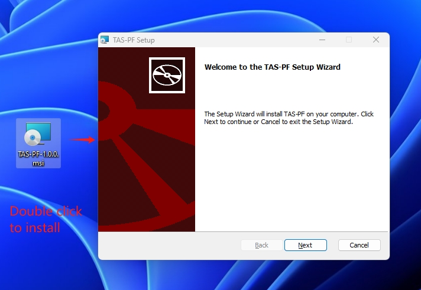
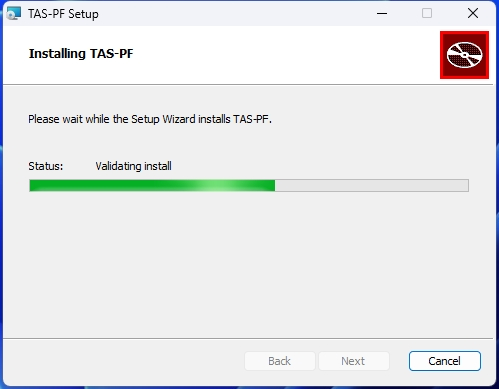
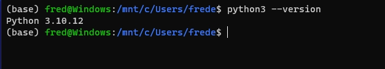
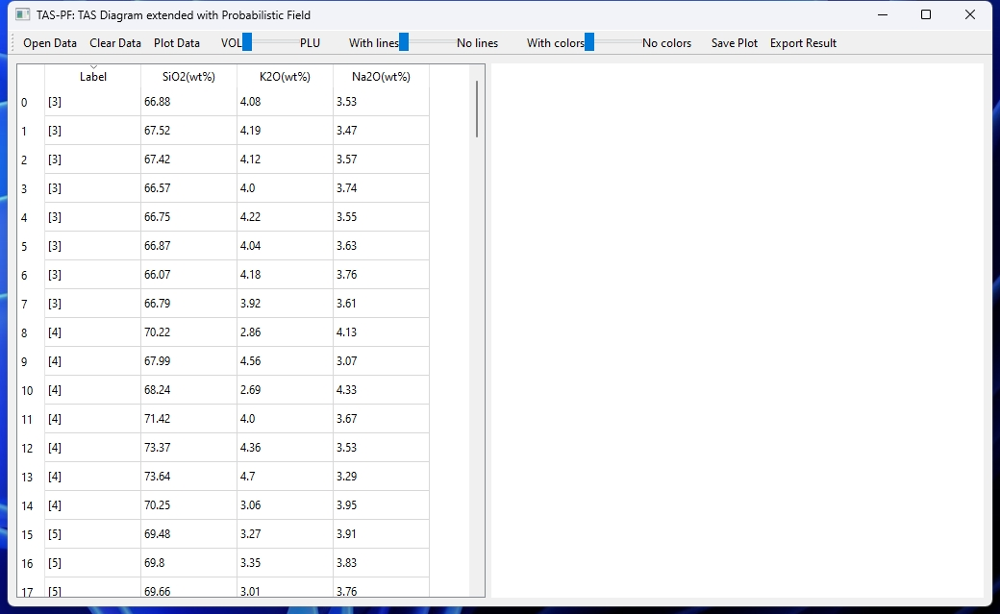
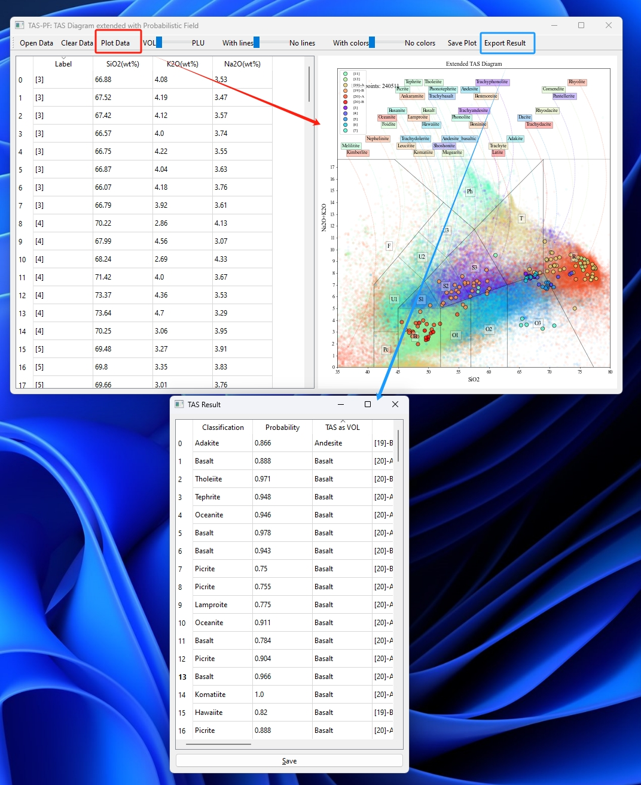
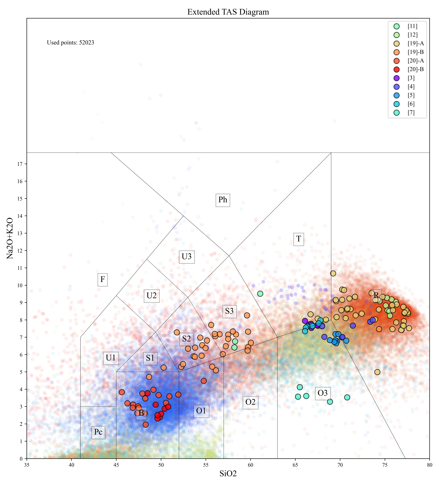
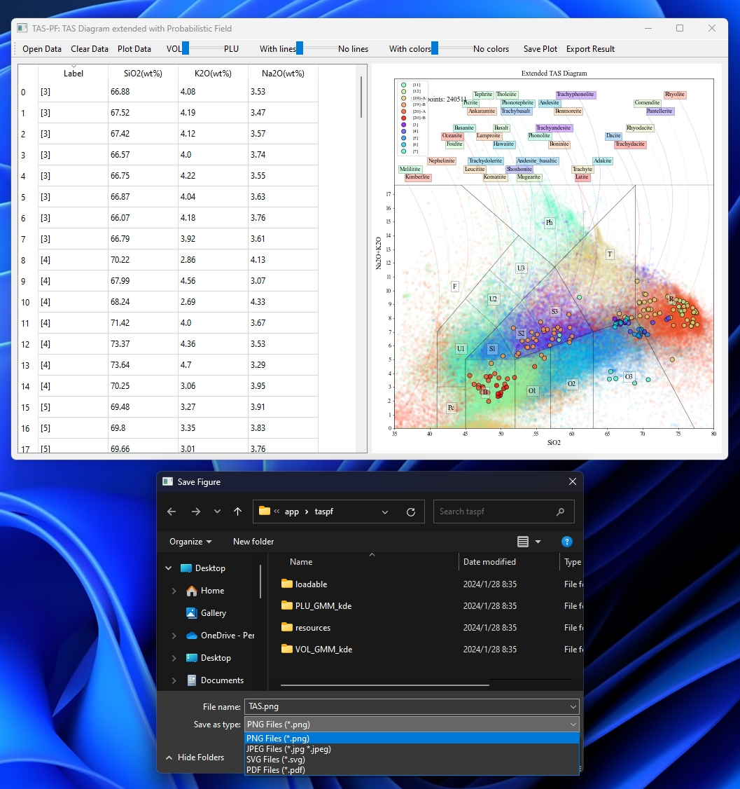

# TAS-PF

TAS-PF：TAS Diagram extended with Probabilistic Field. 
一个利用概率场扩展的TAS图解软件。
版本号：1.0.0

## 1 简介

### 1. 概述

本软件采用概率场（PF）扩展了经典的TAS分类图解方法。TAS，全称为Total Alkali Silica，是一种通过绘制碱与二氧化硅总量关系图来对未定名火成岩进行岩石类型分类的技术。

### 1.1 开发背景与创新

传统TAS方法基于火成岩中总碱与二氧化硅含量的关联性，在二维图解上直观划分岩石类别，其操作简便易行。然而，随着数据集的增长和多样性的增加，传统的边界区分方式可能变得模糊或不稳定。

在此基础上开发的TAS-PF版本引入了概率场概念，其中PF部分即代表这一改进。该概率场是依据GEOROC全球火成岩数据库构建而成，利用大数据分析技术生成的。

在TAS-PF系统中，每个待分类样本会根据从GEOROC数据库获取的概率分布逐一确定所属岩石类别。这种方法不仅保留了经典图解法中的分类边界，确保了新系统的前向兼容性，而且通过引入概率统计手段增强了对新增数据的适应能力，实现了后向兼容性。随着数据量不断积累，概率场模型将更加稳健可靠，从而提供更精确、灵活的火成岩分类解决方案。

### 1.2 开发环境

本软件的开发环境如下：

| 库名       | 版本号   | 功能描述                            |
|------------|----------|-------------------------------------|
| PySide6    | 6.6.1    | Qt 绑定库，用于 Python 的 GUI 开发    |
| beeware    | 0.3.0    | 用于原生跨平台移动和桌面应用开发工具 |
| matplotlib | 3.8.0    | 数据可视化库，绘制高质量的图表     |
| numpy      | 1.26.3   | 科学计算库，提供大量数学函数和数组操作功能 |
| pandas     | 2.1.4    | 数据分析库，提供 DataFrame 等数据结构及数据分析工具 |
| scipy      | 1.11.4   | 科学计算库，包含数值积分、优化、插值等高级数学算法 |
| toga        | 0.4.0    | Python UI 工具包，构建跨平台本地 GUI 应用程序 |
| toga-chart | 0.2.0    | Toga 库的一个扩展，用于创建图表和数据可视化组件 |
| scikit-learn | 1.2.0   | 机器学习库，包含多种监督和无监督学习算法 |

注意：不要盲目追求最新版本，比如scikit-learn，如果更新成新版本，就可能无法运行了。

### 1.3 运行环境

本软件运行所需的最低硬件配置如下：

| 配置项     | 最低要求 |
|------------|----------|
| 处理器     | 2 GHz 或更快的处理器 |
| 运行内存（RAM）   | 4 GB 以上 |
| 空闲硬盘空间   | 1 GB 以上 |
| 显示分辨率      | 1920 x 1080 分辨率 |

本软件结合PySide6与BeeWare，是一种编写跨平台GUI应用：利用PySide6构建界面，借力BeeWare的Briefcase实现一键打包和运行。此方案确保应用在Windows、GNU/Linux等几种主流操作系统上原生运行。

本软件运行所需的推荐操作系统如下：

| 操作系统   | 版本号 | 架构 | 最低版本要求 | 推荐版本要求 |
|------------|--------|------|--------------|--------------|
| Windows    | 10     | x64  | 10            | 11           |
| Linux      | Ubuntu 22.04 | x64  | Ubuntu 20.04 | Ubuntu 22.04 |

## 2 安装

对于Windows用户，安装特别简单。

### 2.1 Windows 系统下载后运行

下载链接： https://pan.baidu.com/s/1QprhPGUFd99K-4MgA9pFCA?pwd=iaiz
提取码： iaiz

请注意，当前提供的安装包仅适用于最新的主流Windows操作系统版本，如Windows 10和Windows 11。对于更早的操作系统版本，由于开发者不具备相应环境且无法进行有效测试，故软件及其依赖包可能无法在这些旧版系统上正常运行。

#### 2.1.1 Windows 系统下使用 MSI 安装包安装

通过上述链接，您可以获取名为 "TAS-PF-1.0.0.msi" 的安装文件。只需简单下载并双击该文件，即可启动安装程序进行软件安装。



安装过程中，您将面临两种模式选择：一种是仅针对当前用户进行安装，另一种则是面向整个系统环境进行全局安装。


安装过程可能需要几分钟，需要一点点耐心等待。



如果看到安装成功的提示，就是可以用了。


安装完成之后在开始菜单里面就能找到安装好的应用了。


如果你需要移除掉已经安装的版本，去应用管理里面卸载即可。


#### 2.1.2 绿色版 zip 文件解压缩运行

在上述链接中，您还会发现一个名为 "TAS-PF-1.0.0.zip" 的文件。下载并解压该文件后，将会生成一个独立的文件夹。为了确保内置解释器能够正常运行，请务必将其存放于一个`全英文路径`下，并`避免路径中包含任何空格字符`。


保证路径没有问题之后，到解压缩的文件夹内寻找一个叫做 "TAS-PF.exe"的文件，双击这个"TAS-PF.exe"文件就可以运行程序了。


### 2.2 克隆代码然后运行

#### 2.2.1 克隆代码

这个运行方法主要适合 GNU/Linux 和 macOS 用户，当然 Windows 用户也可以这么运行，就是有点麻烦了。

要运行本项目的应用软件，需要使用 git 来克隆，因此要实现安装，而且还需要能够有流畅的网络，访问 github 来获取代码。克隆好代码之后，还需要一个 Python 3.10 或者以上的版本来运行克隆好的文件。



除了上述提及的文件之外，还可能需要安装一些其他的系统层级依赖包。

在此，我们以开发者所采用的具体操作系统环境——Ubuntu 22.04.3 LTS为例进行说明。

为了确保项目的完整运行，首先，请按照以下命令进行依赖包的安装：

```Bash
sudo apt update
sudo apt install build-essential git pkg-config python3-dev python3-venv libgirepository1.0-dev libcairo2-dev gir1.2-webkit2-4.0 libcanberra-gtk3-module  libxkbcommon0 qtwayland5 libegl1-mesa
```

如果不进行上面的步骤，后面在 `pip install pycairo` 就可能会出错，就无法完成依赖环境的完整安装。

然后克隆代码和pip安装依赖包的命令如下所示：

```Bash
git clone https://github.com/GeoPyTool/TAS-PF.git
cd TAS-PF
pip install -r requirement.txt
```

如果完成了上述的依赖包安装，就能看到类似下面的信息，有时候可能有一些 warning ，但这都不会有太大问题，只要不是 error 就基本都没事。


#### 2.2.2 运行项目

还是保持在克隆的代码的路径，然后找到子文件夹 'taspf'，利用 cd 命令进入，然后运行 'briefcase run' 就可以运行代码了。

```Bash
cd taspf
briefcase run
```

第一次运行可能需要联网更新一些程序模板等等，所以可能还需要一点时间，耐心是美德，没办法，只能等待，而且还要有一个比较稳定的网络环境，以便于访问 GitHub。


这些很耗费时间的步骤基本上只是出现在第一次运行的时候，后续的运行过程中就不会有太多类似的问题了，也会节省很多时间。


## 3 操作与使用

TAS-PF的设计非常简单，所以用起来应该很容易上手

### 3.1 数据文件格式

TAS-PF 支持 CSV 和 Excel 文件，具体的设置可以参考下面的截图：


必须有的列就是 `Label,SiO2(wt%),K2O(wt%),Na2O(wt%)`，`Label`就是你的样品标签， `SiO2(wt%)`和 `K2O(wt%)+Na2O(wt%)` 是你要投图的数据。

注意，这里你应该使用将所有氧化物相加然后再校准过的数据，才比较可靠。

为了简化运行流程和降低设计复杂度，TAS-PF本身不再提供数据归一化的功能，这个大家自己在Excel或者WPS上就能完成，也不麻烦。

这次的TAS-PF不需要任何额外设置，程序可以根据数据的label分组自动赋给不同的颜色，参考数据例如 [data_samples/TAS.csv](./data_samples/TAS.csv).

### 3.2 运行程序

无论是如何安装和运行，整体的图形界面都基本一样：


#### 3.2.1 打开数据文件

就选择一个 CSV 或者 Excel 文件就可以加载到程序界面了。



#### 3.2.2 投图和判断

主界面上有 `Plot Data`和 `Export Result` 两个按钮，按前者就会生成投图，按后者就会弹出分类结果。



这个操作流程非常直观，基本不需要什么学习成本，大家根据直觉来探索着很快就能上手。

#### 3.2.3 保存结果


弹出的判断结果表格可以保存成一个文件，可以参考 [/data_samples/TAS_Result.csv](./data_samples/TAS_Result.csv)，实际就是在源数据文件的左侧加上概率场判断类别、判断概率、TAS经典图解判断类别这三列。

### 3.3 切换效果

在图形界面上，可以在VOL和PLU之间切换GEOROC底图数据，另外还可以切换是否显示线条，还有对底图显示的开关。


具体效果如下所示：

##### Traditional Diagram


##### VOL with Probabilistic Field


##### PLU with Probabilistic Field


##### VOL with No Lines


##### PLU with No Lines



### 3.4 保存投图

经过一番调整之后，如果你想要保存下来当前投图，就可以点击 `Save Plot`，如下图所示：



该程序提供了四种保存格式：JPG和PNG两种是位图，PDF和SVG两种是矢量图。大家如果用CorelDraw或者Adobe Illustrator，推荐使用PDF。如果使用 Ink Scape 或者 Affinity Designer，推荐使用 SVG。


## 4 致谢

该项目的灵感源于我已故的同学——李解博士。同窗逾十载，我们曾经一起组装电脑、学习编程、开发软件，也曾经讨论各种学术问题。不幸的是，在2023年，李解博士在毕业不久之后因病逝世。他曾对我早期项目中关于分类界限的过分应用提出过批判性的见解，而这个问题我一直未能寻得理想的解决方案。原本计划与他一同改进。奈何天妒英才，斯人已逝，如今只能独自尝试了。通过构建概率场的方式来弥补原有分类边界的不足，催生了本项目。这个项目的诞生是对李解博士深刻批评的回应，也承载着对他的怀念。

